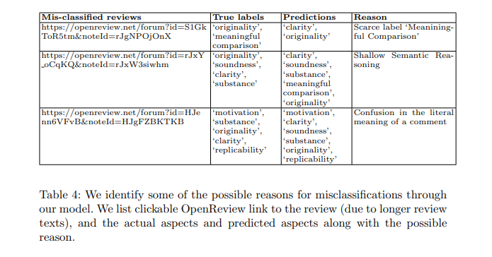

# Error Anlysis

Despite having good performance, our model struggles with some of the challenge cases. We identify some possible reasons which results in misclassification
in Table 4. Due to the longer review texts, we have provided the clickable OpenReview links to the review texts below:
* Review #1 : [Link](https://openreview.net/forum?id=HJenn6VFvB&noteId=HJgFZBKTKB)
* Review #2 : [Link](https://openreview.net/forum?id=rJxY_oCqKQ&noteId=rJxW3siwhm)
* Review #3 : [Link](https://openreview.net/forum?id=HJenn6VFvB&noteId=HJgFZBKTKB)

The error for first case is due to shallow semantic reasoning. 
In the first example, the model does not predict ‘meaningful comparison’. 
We attribute this due to the imbalance in the data, and ’meaningful comparison’ aspect is scarce in the dataset.
But we also note that the model predicts ‘clarity’ even though it’s not the actual aspect in the review.
This is due to the third sentence, *“ Then they explain very clearly that in practice the connection is not exact”*, which clearly has information about the ‘clarity’ aspect.
However, the interpretation of ‘clarity’ here is not with the writing part of the paper which is why this aspect in not present in the annotations for this review.

Another reason for errors is shallow semantic reasoning. 
For example, in example 2, the model erroneously predicts ‘meaningful comparison’. 
‘Meaningful comparison’ aspect is used to comment about the quality and usefulness of comparisons stated in the paper with other methods in broader research field, 
and whether they are sound or not. But sometimes our model fails to understand that in which sense the comparisons are being referred to. 
For review sentence, 
*“the authors mention that their models train faster and don’t require labelled data,
but some more details of what exactly was compared would be helpful. e.g. what
exactly was pre-trained and fine tuned,”* 
the reviewer is commenting about missing details of comparison stated in the paper and not with the other methods in the academic field, 
(which makes it fall under category ‘substance’) and not on the quality of comparisons being made. 

For the third example, in the sentence
“the authors present a method for learning hamiltonian functions that govern a dynamically...”*, the reviewer is talking about the motivation of the method
used, and not about how the method of approach is. Moreover, the reviewer has also spoken about the overall pros and missing details in the approach. Hence,
the model sees these as features of ‘soundness’. Thus, the model also struggles with confusion about the true meaning of the aspect, 
especially for ‘soundness’ and ‘substance’.